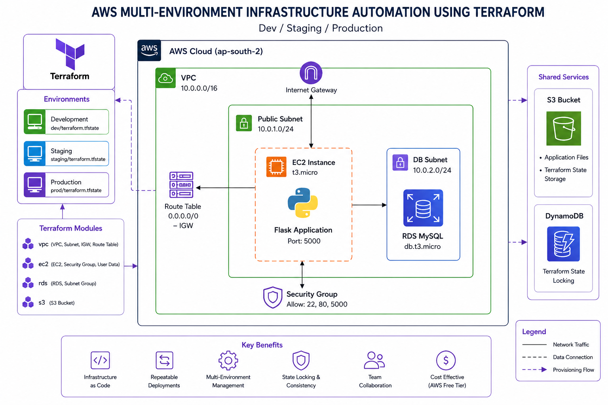
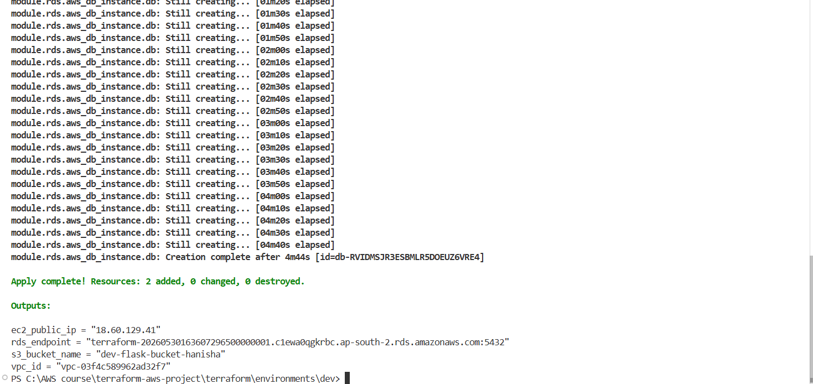
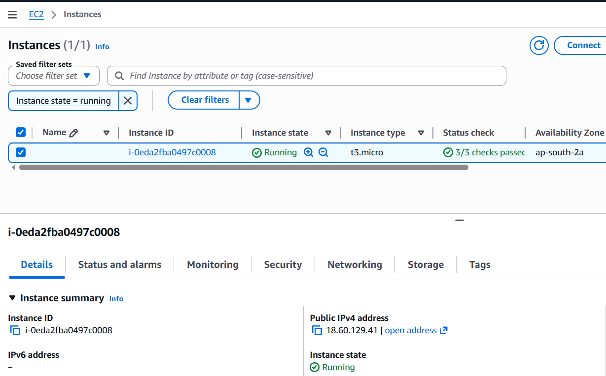
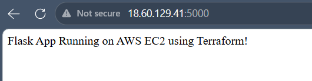
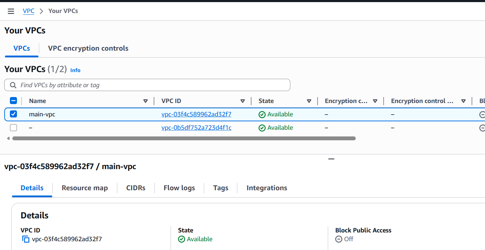
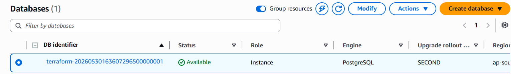
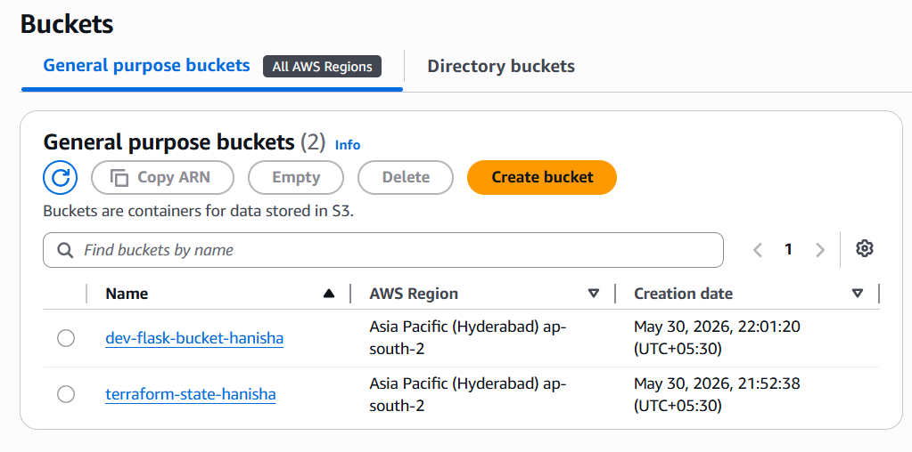
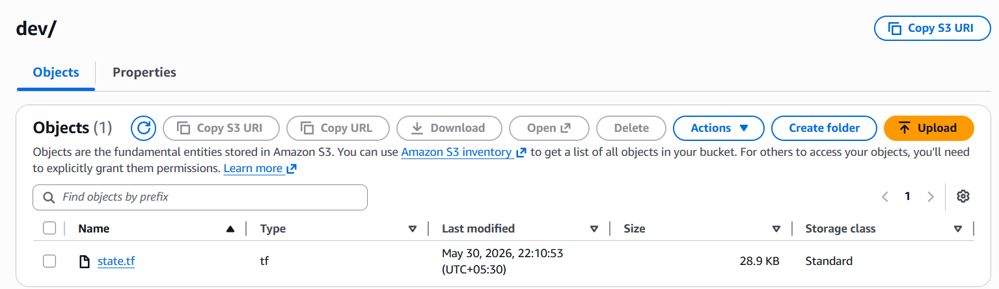
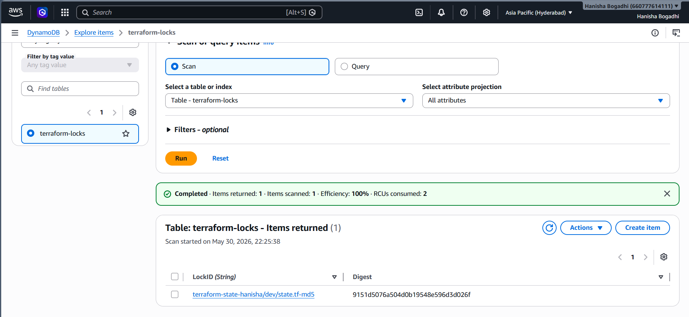

# AWS Multi-Environment Infrastructure Automation using Terraform

Provisioned AWS infrastructure using Terraform modules across **Development (Dev)**, **Staging**, and **Production (Prod)** environments. The project automates deployment of AWS networking, compute, storage, and database resources while following Infrastructure as Code (IaC) and DevOps best practices.

---

## Project Overview

This project demonstrates how to:

- Provision AWS infrastructure using Terraform
- Create reusable Terraform modules
- Manage multiple environments (Dev, Staging, Prod)
- Configure remote Terraform state using S3
- Enable state locking using DynamoDB
- Deploy a Python Flask application on EC2
- Implement Infrastructure as Code (IaC) best practices
- Use environment-specific configurations

---

## Architecture



---

## Architecture Flow

```text
                    Terraform
                         |
                         |
         --------------------------------
         |              |               |
       Dev          Staging          Prod
         |              |               |
         --------------------------------
                         |
                    AWS Cloud
                         |
       ---------------------------------------
       |                 |                  |
      VPC               EC2                RDS
       |                 |                  |
   Public Subnet     Flask App         MySQL Database
       |
       |
      S3
       |
Terraform Remote State

       |
DynamoDB
(State Locking)
```

---

## AWS Services Used

| Service | Purpose |
|----------|----------|
| VPC | Network Isolation |
| Subnet | Public Network |
| Internet Gateway | Internet Access |
| Route Table | Routing Configuration |
| EC2 | Flask Application Hosting |
| RDS | MySQL Database |
| S3 | Application Storage & Terraform State |
| DynamoDB | Terraform State Locking |
| IAM | AWS Authentication |
| Security Groups | Firewall Rules |

---

## Tech Stack

- Terraform
- AWS
- EC2
- VPC
- S3
- RDS
- DynamoDB
- Python Flask
- Git
- GitHub

---

## Project Structure

```text
terraform-aws-project/
│
├── app/
│   ├── app.py
│   └── requirements.txt
│
├── terraform/
│   │
│   ├── modules/
│   │   ├── ec2/
│   │   ├── rds/
│   │   ├── s3/
│   │   └── vpc/
│   │
│   └── environments/
│       ├── dev/
│       ├── staging/
│       └── prod/
│
├── screenshots/
│
├── .gitignore
│
└── README.md
```

---

# Terraform Modules

## VPC Module

Creates:

- VPC
- Public Subnet
- Internet Gateway
- Route Table
- Route Table Association

---

## EC2 Module

Creates:

- EC2 Instance
- Security Group
- User Data Script
- Flask Application Deployment

---

## RDS Module

Creates:

- MySQL Database
- DB Subnet Group
- Database Endpoint

---

## S3 Module

Creates:

- Application Storage Bucket

---

# Remote State Configuration

Terraform state is stored remotely in Amazon S3.

Benefits:

- Centralized state management
- Team collaboration
- State versioning
- Backup and recovery

Terraform locking is implemented using DynamoDB to prevent concurrent infrastructure modifications.

---

## Environment Strategy

### Development

Used for:

- Development
- Infrastructure Testing
- Resource Validation

---

### Staging

Used for:

- Pre-production Testing
- Release Validation

---

### Production

Used for:

- Live Deployment
- Stable Infrastructure

---

# Deployment Workflow

```text
Write Terraform Code
         |
         ▼
terraform init
         |
         ▼
terraform validate
         |
         ▼
terraform plan
         |
         ▼
terraform apply
         |
         ▼
AWS Infrastructure Created
         |
         ▼
Flask Application Deployed
```

---

# Setup Instructions

## Clone Repository

```bash
git clone https://github.com/Hanisha-Bogadhi/terraform-aws-project.git

cd terraform-aws-project
```

---

## Configure AWS Credentials

```bash
aws configure
```

Provide:

```text
AWS Access Key ID
AWS Secret Access Key
Region: ap-south-2
Output Format: json
```

---

## Initialize Terraform

```bash
cd terraform/environments/dev

terraform init
```

---

## Validate Configuration

```bash
terraform validate
```

---

## Review Execution Plan

```bash
terraform plan
```

---

## Deploy Infrastructure

```bash
terraform apply
```

Type:

```text
yes
```

---

## View Outputs

```bash
terraform output
```

---

## Access Flask Application

```text
http://<EC2_PUBLIC_IP>:5000
```

---

# Screenshots

## Terraform Apply Success



---

## EC2 Instance Running



---

## Flask Application



---

## VPC Resources



---

## RDS Database



---

## S3 Buckets



---

## Terraform State in S3



---

## DynamoDB State Locking



---

# Security Considerations

- Terraform state stored remotely
- State locking enabled
- AWS credentials excluded from Git
- SSH keys excluded from Git
- Security Groups configured for controlled access
- Environment-specific resource isolation

---


# Cleanup

To avoid AWS charges:

```bash
terraform destroy
```

Type:

```text
yes
```

---

# Author

Hanisha Bogadhi
